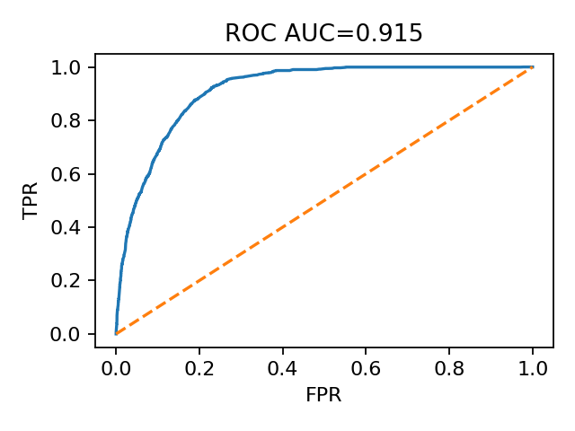
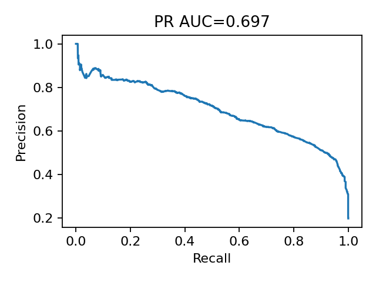
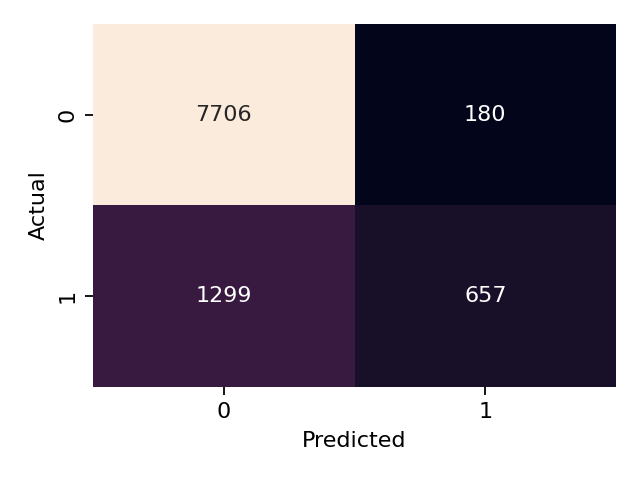
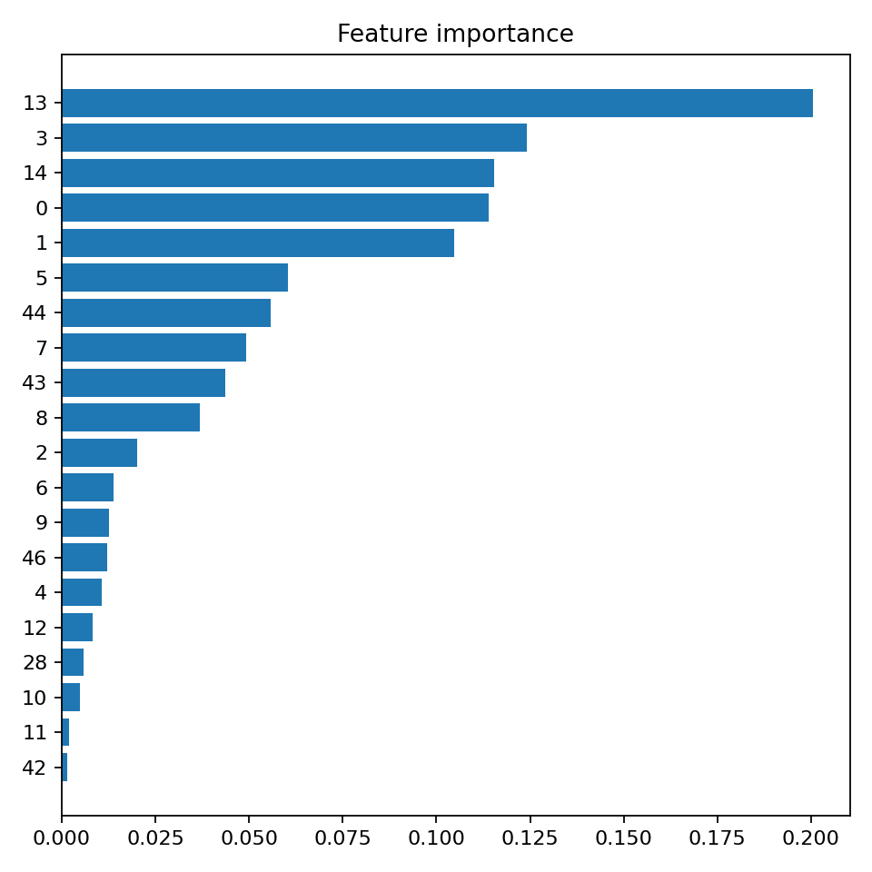

# Customer Churn Prediction (Capstone)

Fintech customer churn prediction with Python (scikit-learn, CatBoost/XGBoost).  
See `notebooks/` for the workflow and `reports/papers/` for the written report.

## Quickstart
Run:
    python -m pip install -r requirements.txt
    jupyter notebook

> Sample data: a tiny CSV lives in `data/sample/` for structure-only inspection. Full datasets/models are not tracked.

## Repository structure
- `notebooks/` — EDA, feature engineering, clustering, modeling
- `data/` — local data (ignored). Keep tiny samples in `data/sample/`
- `models/` — trained models/artifacts (ignored)
- `artifacts/` — run logs (e.g., CatBoost) (ignored)
- `reports/` — figures, papers, and numeric outputs (JSON/TXT)
- `assets/` — images used in this README (ROC/PR/confusion matrix, etc.)

## Model evaluation

**Key metrics** (from `reports/outputs/metrics.json`)

| Metric | Value |
|---|---|
| ROC AUC | **0.9151** |
| PR AUC | **0.6969** |
| Accuracy @0.50 | **0.8497** |
| Precision @0.50 | **0.7849** |
| Recall @0.50 | **0.3359** |
| F1 @0.50 | **0.4705** |
| Support | **9842** |

**Operating-point suggestions** (from `reports/outputs/threshold_summary.txt`)
- Best **F1** threshold: **0.245** → F1 = **0.668**
- Best **Youden’s J** threshold: **0.195** → J = **0.693**

## Notebook map (what & why)
1. **01 · Merge** — Consolidates raw sources into a single analytical table.
2. **02 · EDA & Feature Engineering** — Exploratory analysis; derives predictive features.
3. **03 · Clustering** — Customer segmentation to understand behavior profiles.
4. **04 · Train/Test Split(s)** — Creates task-specific train/prediction sets.
5. **05 · Modeling & Evaluation** — Trains models (e.g., CatBoost/XGBoost), tunes thresholds, and exports the plots & metrics above.

## Reproducibility
- Heavy data/models are intentionally **not** versioned; re-run notebooks with your local data.
- Logs go to `artifacts/`. Metrics and summaries land in `reports/outputs/`.

---

## Español

**Predicción de churn** en un contexto fintech con Python (scikit-learn, CatBoost/XGBoost).  
Consulta `notebooks/` para el flujo de trabajo y `reports/` para figuras y resultados.

**Métricas principales**
- ROC AUC: **0.9151**, PR AUC: **0.6969**  
- Umbrales sugeridos: F1 @ **0.245** (F1=**0.668**), Youden J @ **0.195** (J=**0.693**)

**Estructura**
- `notebooks/` (análisis y modelado) · `assets/` (gráficos) · `reports/outputs/` (métricas)
